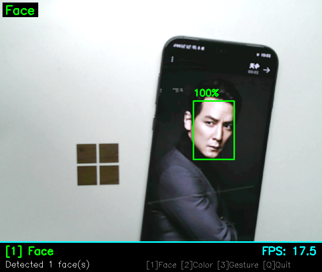
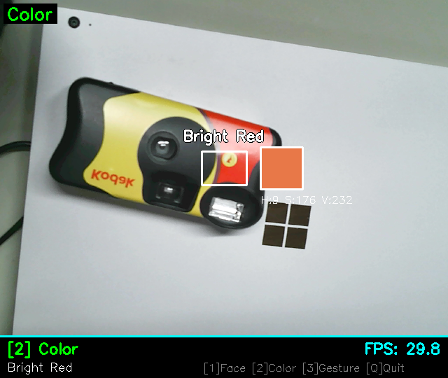
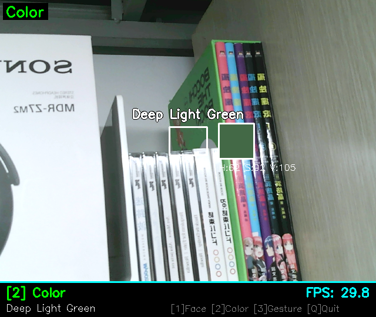
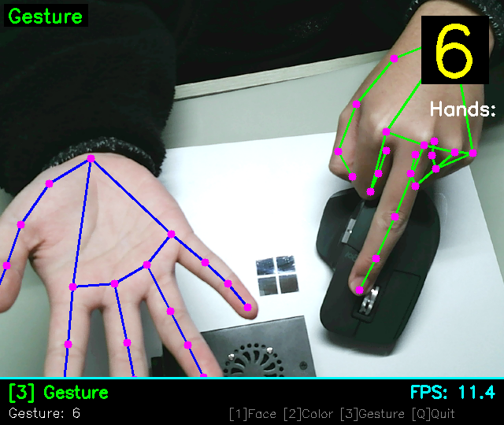

# PiVision-Trio

**Real-time tri-state vision: face / color / gesture (0-10)**

> ⚠️ Tested only passed on Raspberry Pi 5 (Ubuntu). Other platforms are unverified.

## Features

- Face detection: OpenCV DNN (SSD-ResNet10) with Haar fallback.
- Color recognition: center ROI HSV statistics with 256+ names, low-sat/value filtered.
- Gesture recognition: MediaPipe Hands using extended finger count (0-10).

## Runtime Preview









## Requirements

- Python 3.11
- Camera device (USB or CSI)

## Local Development

1. Create a virtual environment

    ```bash
    python3.11 -m venv .venv
    source .venv/bin/activate
    ```

2. Install dependencies

    ```bash
    pip install -r requirements.txt
    ```

3. Run the app

    ```bash
    src/main.py --camera 0 --width 640 --height 480
    ```

## Install Script

```bash
bash scripts/install.sh
```

The script installs system dependencies (uses sudo when available), downloads
face models into `models/`, and creates a `.venv` virtual environment.

## Usage

```bash
./.venv/bin/python src/main.py --camera 0 --width 640 --height 480
```

## CLI Arguments

| Argument | Default | Description |
| --- | --- | --- |
| `--camera` / `-c` | `0` | Camera device ID |
| `--width` / `-W` | `640` | Frame width |
| `--height` / `-H` | `480` | Frame height |

## Controls

- `1`: Face detection
- `2`: Color recognition
- `3`: Gesture recognition
- `q`: Quit

## Detector Notes

### Face Detection

- Uses DNN models from `models/opencv_face_detector.*`.
- Falls back to Haar Cascade when model files are missing.
- Outputs face boxes and confidence (fixed value in Haar mode).

### Color Recognition

- Samples center ROI, filters low-sat/value pixels, and maps HSV stats to a color name.
- Renders a color swatch and HSV values on the frame.
- `ColorDetectorConfig.min_saturation` and `min_value` gate which pixels contribute.

### Gesture Recognition

- Requires MediaPipe Hands.
- Outputs 0-10 based on total extended fingers (two-hand sum).
- Draws hand landmarks and connections with a right-top label.

## Configuration

Defaults live in `config/settings.py`.

| Module | Setting | Default | Description |
| --- | --- | --- | --- |
| Camera | `device_id` | `0` | Camera device ID |
| Camera | `width` / `height` | `640` / `480` | Frame size |
| Camera | `fps` | `30` | Target FPS |
| Face | `confidence_threshold` | `0.6` | DNN confidence threshold |
| Face | `use_dnn` | `True` | Prefer DNN when available |
| Color | `roi_scale` | `0.1` | ROI scale |
| Color | `min_saturation` | `50` | Minimum saturation for color sampling |
| Color | `min_value` | `50` | Minimum value for color sampling |
| Gesture | `max_num_hands` | `2` | Max hands |
| Gesture | `min_detection_confidence` | `0.7` | Detection confidence |
| Gesture | `min_tracking_confidence` | `0.5` | Tracking confidence |
| UI | `panel_height` | `60` | Info panel height |
| App | `key_bindings` | `1/2/3/q` | Mode and quit keys |

## Models

Face model files are in `models/`. See `models/README.md` for sources and
licenses.

## License

This project is licensed under the MIT License. See `LICENSE` for details.
